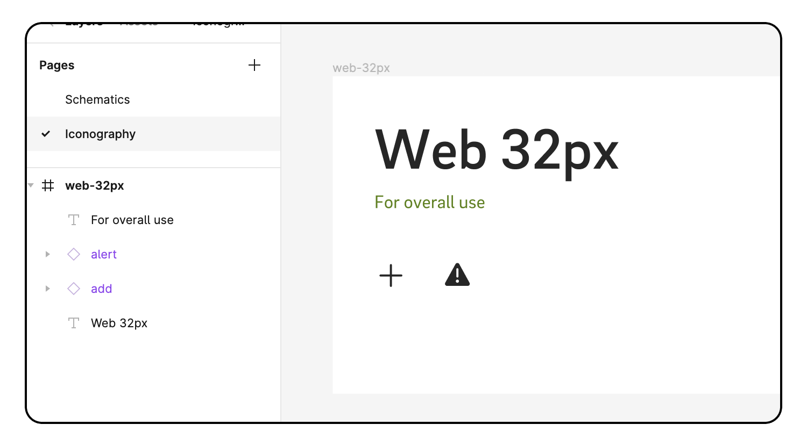
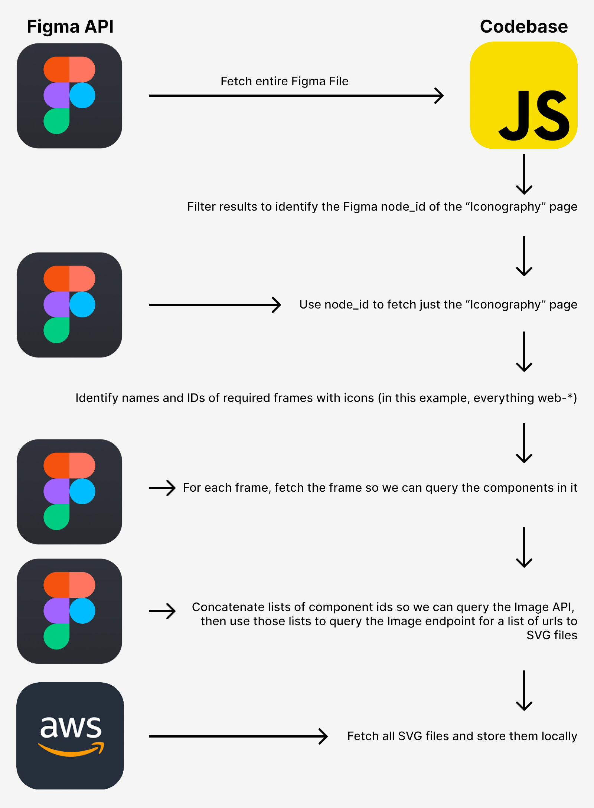

#  Figma Assets Sync

  

##  Overview


### Description

This is a (working) example of how to use the Figma API to pull assets like SVG images, directly into your codebase. Through several requests to the Figma API, we parse the Figma document to drill down to the - in our case - Icon components that we want to export as SVG elements. We then download each SVG from the Figma AWS instance.

### Schematics

Consider the following structure in Figma:



As you can see, we group our icons onto a single `page`. We then have different `frames` for our different Icon sets as we want to clearly distinguish them. Finally, each frame contains a lot of icons, each of which is defined as a `component` in Figma.

We are using multiple fetches to the API to grab what we need. A good thing to keep in mind here is that everything in Figma has a `node_id` which can be used to query their API services, so regardless of a `component`/`frame`/`page`, they will all have a unique ID. An overview:

1. So first things first, we fetch the entire document from the Files API. We then loop over its direct children which are the pages as defined in Figma. For our needs, we just need the `Iconography` page so we match this name to grab the `node_id` of that page.
2. With that `node_id` we now grab just the `page` and it's `frames` from the Files API. The direct children are now the frames that are defined within this `page`. Because we have frames with guidelines and such, we match the frame name to be `web-*` so we can grab the frames of our icon sets (`web-32` in the example).
3. For each `frame`, we again query the Files API with the respective `node_id`. We now get access to a `components` key in the returned object. This contains an array with all the `components` defined in this `frame`. We concatenate these in one long string (`id1,id2,id3,etc`) .
4. With the concatenated string we query the Images API, this gives us an object with for each supplied `node_id`, a URL which refers to an AWS instance of Figma, containing the SVG of that icon.
5. We fetch each icon and save it locally in `./icons/<frame_name>/<component_name>.svg`

A small overview:



*(While writing this, I realise the data requested with the 2nd step and API call; should be available during the first call so this might be refactored)*
  

##  Installation

To tinker around with the script, pull the repo and install with your preferred package manager. Then simply run the script by calling `fetch`. We do rely on `chalk` for logging and `axios` for querying but besides that, no further dependencies.

Do make sure that you create a local `.env` file containing a `API_KEY` for your Figma account as well as a `ID` of your Figma document. (Click share in Figma to get an URL with your document ID). In `./src/constants.js` you can fiddle around with the settings of the page name and the regex that is used to identify the required frame. Of course, you can also alter the code directly if you have your Figma set up differently.
  

```bash

yarn install
yarn fetch

```
